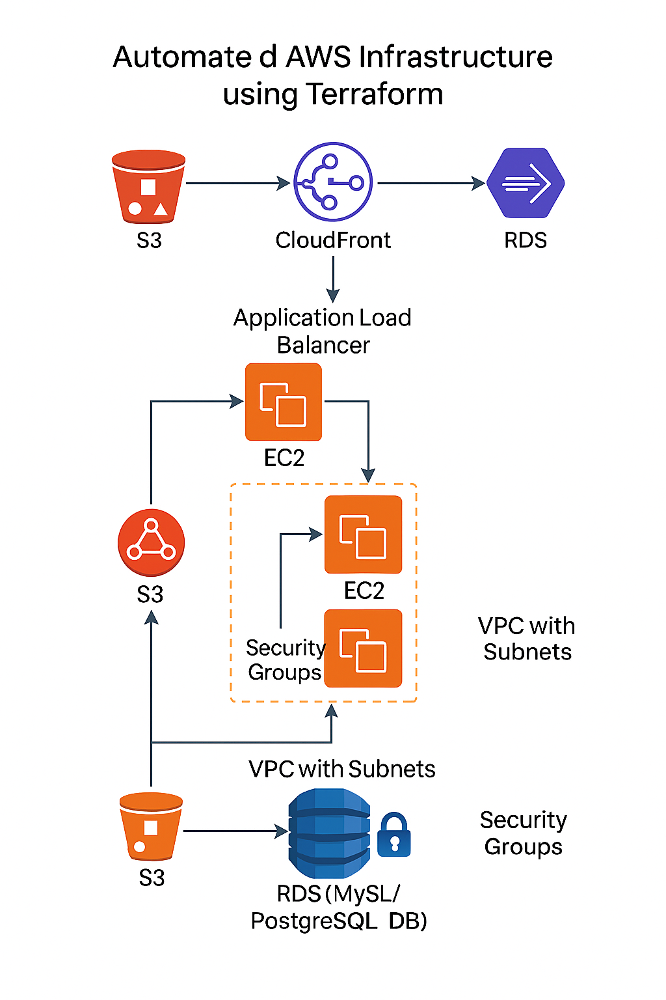

# Automated AWS Infrastructure using Terraform (Free-Tier Safe)

## Overview
Implemented end-to-end cloud infrastructure automation using Terraform (free-tier safe).  
Provisioned a secure VPC, public subnet, EC2 instance, and S3 bucket only — suitable for testing on AWS Free Tier.
This repository is for learning and portfolio purposes. **Do not run apply on accounts without understanding costs.**

## Architecture Diagram


## Tech Stack
- Terraform  
- AWS (VPC, EC2, S3, Security Groups)  
- Git & GitHub  
- Infrastructure as Code (IaC)

## Included Files
- `provider.tf` — AWS provider configuration  
- `main.tf` — resources: VPC, subnet, IGW, route table, security group, EC2, S3  
- `variables.tf` — variables with defaults  
- `outputs.tf` — useful outputs (EC2 IP, S3 name)  
- `terraform.tfvars.example` — example variables file (do not commit secrets)  
- `.gitignore` — ignores tfstate and secrets

## Quick Start (safe)
1. Install Terraform (v1.1+).  
2. Configure AWS credentials: `aws configure` or set `AWS_ACCESS_KEY_ID`/`AWS_SECRET_ACCESS_KEY`.  
3. Copy example vars:
   ```bash
   cp terraform.tfvars.example terraform.tfvars
   ```
   Edit `terraform.tfvars` to set values (do not commit).
4. Initialize and preview:
   ```bash
   terraform init
   terraform plan
   ```
5. Apply (creates real AWS resources — Free Tier recommended):
   ```bash
   terraform apply
   ```
6. Cleanup:
   ```bash
   terraform destroy
   ```

## Notes
- This is the **Free-Tier Safe** version: RDS and Load Balancer are intentionally excluded.
- Keep secrets out of git. Use environment variables or terraform.tfvars (gitignored).
- For team/state: use S3 backend + DynamoDB locking (not included here).

## Author
Navash Ahamed — AWS Cloud Practitioner  
Email: navasahamed319@gmail.com
